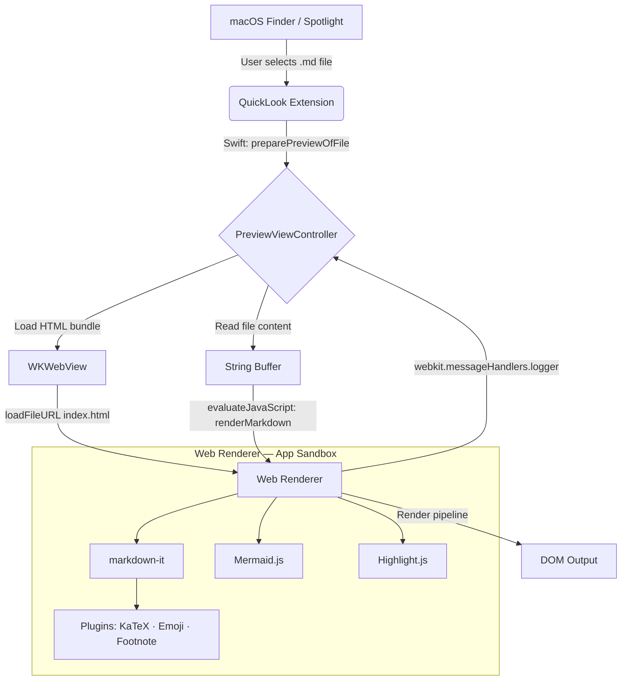

FluxMarkdown is a macOS QuickLook extension that renders Markdown files with full support for math (KaTeX), diagrams (Mermaid), and syntax highlighting. This page explains why the project uses a hybrid Swift + TypeScript architecture, how the components fit together, and how data moves from a file on disk to pixels on screen.

## Why a hybrid architecture?

A pure-native Swift implementation of GitHub-Flavored Markdown with Mermaid, KaTeX, and syntax highlighting would require reimplementing a significant portion of the JavaScript ecosystem from scratch. That path both increases maintenance burden and risks visual divergence from the reference rendering experience.

FluxMarkdown instead uses a **native Swift host** that embeds a `WKWebView` running a **bundled TypeScript renderer**. This approach lets the project reuse battle-tested npm packages directly — the same libraries used by Markdown Preview Enhanced — while keeping the app sandboxed and distributed as a standard macOS extension.

<AccordionGroup>
  <Accordion title="Trade-offs of the hybrid approach" icon="scale-balanced">
    **Benefits:**
    - Reuses `markdown-it`, `mermaid`, `katex`, and `highlight.js` without porting them.
    - Rendering output stays visually consistent with the JavaScript ecosystem.
    - The TypeScript layer is independently testable with Jest.

    **Trade-offs:**
    - Slightly higher memory use than a native text view (`WKWebView` runs in its own process).
    - A shared `WKProcessPool` is used to cap process count when previewing multiple files simultaneously.
    - Features that require Node.js APIs (`fs`, `child_process`) cannot run inside the App Sandbox.
  </Accordion>
</AccordionGroup>

## Component overview



### Swift host

The Swift side is divided across two targets in `project.yml`:

- **`Sources/Markdown/`** — A minimal SwiftUI container (the Host App). It provides the app bundle that embeds the extension and handles auto-update via Sparkle.
- **`Sources/MarkdownPreview/`** — The QuickLook Extension (AppKit). `PreviewViewController` implements `QLPreviewingController`, manages the `WKWebView` lifecycle, reads the file from disk, and calls into JavaScript to trigger rendering.

### TypeScript renderer

The `web-renderer/` directory is a standalone Vite project. It is compiled to a **single self-contained `dist/index.html`** with all JavaScript, CSS, and fonts inlined (via `vite-plugin-singlefile`). Xcode includes this file as a bundle resource; Swift loads it with `webView.loadFileURL(_:allowingReadAccessTo:)`.

The renderer exposes two globals that Swift calls:

| Function | Purpose |
|---|---|
| `window.renderMarkdown(content, options)` | Parse and render Markdown to the DOM |
| `window.renderSource(content, theme)` | Show raw Markdown source with diff marks |
| `window.updateTheme(theme)` | Switch light/dark/system theme without a full re-render |

## Directory structure

<CardGroup cols={2}>
  <Card title="Sources/Markdown/" icon="house" href="/dev/architecture">
    Host App (SwiftUI). Minimal container that embeds the QuickLook extension and bundles Sparkle for auto-updates.
  </Card>
  <Card title="Sources/MarkdownPreview/" icon="eye" href="/dev/architecture">
    QuickLook Extension (AppKit). Contains `PreviewViewController.swift` — the core of the extension.
  </Card>
  <Card title="web-renderer/" icon="code" href="/dev/renderer/overview">
    TypeScript rendering engine (Vite + markdown-it). Compiled to a single inlined `dist/index.html`.
  </Card>
  <Card title="scripts/" icon="terminal" href="/dev/release/release-process">
    Versioning, DMG creation, Homebrew cask updates, and GitHub release automation.
  </Card>
</CardGroup>

| Path | Purpose |
|---|---|
| `project.yml` | XcodeGen configuration. Edit this to add files or targets; run `make generate` to apply. |
| `Makefile` | Orchestrates the full build: renderer → XcodeGen → `xcodebuild`. |
| `.version` | Single source of truth for the version string (e.g. `1.13.149`). |
| `Sources/Shared/` | Code shared between the Host App and the extension targets. |

<Warning>
  Never edit `FluxMarkdown.xcodeproj` directly. It is generated by XcodeGen from `project.yml` and is excluded from version control. Always modify `project.yml` and run `make generate`.
</Warning>

## Data flow: file preview step by step

When a user presses Space on a `.md` file in Finder, the following sequence runs:

<Steps>
  <Step title="QuickLook invokes the extension">
    macOS selects the FluxMarkdown extension based on the UTI (`net.daringfireball.markdown`). QuickLook instantiates `PreviewViewController`.
  </Step>
  <Step title="Swift reads the file">
    `preparePreviewOfFile(at:completionHandler:)` is called with the file URL. Swift reads the file contents into a `String`. Files larger than 500 KB are truncated at a newline boundary to keep the preview responsive.
  </Step>
  <Step title="WKWebView loads the HTML bundle">
    `viewDidLoad()` loads `dist/index.html` from the app bundle using `webView.loadFileURL(_:allowingReadAccessTo:)`. The renderer initialises its libraries and signals readiness back to Swift via the `logger` message handler.
  </Step>
  <Step title="Swift calls window.renderMarkdown">
    Once the handshake is complete, Swift calls `webView.evaluateJavaScript("return window.renderMarkdown(content, options)")`. The Markdown string and options (theme, base URL, language) are JSON-serialised before being passed across the bridge.
  </Step>
  <Step title="TypeScript renders to the DOM">
    `markdown-it` parses the Markdown. KaTeX processes math blocks, Mermaid renders diagrams asynchronously, and Highlight.js applies syntax colouring to fenced code blocks. The result is written to the DOM.
  </Step>
  <Step title="Local images are served via a custom scheme">
    The `LocalSchemeHandler` in Swift handles `local-md://` requests, reading image files from the directory containing the previewed Markdown file and returning them to the WebView. This is how images in Markdown are resolved while remaining within the App Sandbox.
  </Step>
</Steps>

## JS-to-Swift bridge

The bridge is intentionally narrow. JavaScript logs back to Swift by posting messages to a named handler:

```typescript
// web-renderer/src/index.ts
window.webkit.messageHandlers.logger.postMessage("render complete");
```

```swift
// Sources/MarkdownPreview/PreviewViewController.swift
userContentController.add(self, name: "logger")

public func userContentController(_ controller: WKUserContentController,
                                  didReceive message: WKScriptMessage) {
    // message.name == "logger"
    // message.body contains the log payload
}
```

Three message handlers are registered: `logger` (diagnostics), `linkClicked` (external link routing), and `pinchZoom` / `gestureZoom` (zoom events).

## App Sandbox considerations

The extension runs under the macOS App Sandbox. The following constraints apply:

<AccordionGroup>
  <Accordion title="File system access" icon="folder">
    The extension receives read-only, security-scoped access to the specific file QuickLook is previewing. `url.startAccessingSecurityScopedResource()` is called before reading and balanced with `stopAccessingSecurityScopedResource()` when the preview is dismissed.
  </Accordion>
  <Accordion title="Network access" icon="wifi">
    Outbound network access is disabled. The renderer bundle is fully self-contained — all fonts, CSS, and JavaScript are inlined at build time. External images in Markdown are not fetched; only local images (served via the `local-md://` scheme handler) are displayed.
  </Accordion>
  <Accordion title="JavaScript execution" icon="code">
    The original `@shd101wyy/mume` rendering engine depends on Node.js APIs (`fs`, `path`, `child_process`) that are unavailable in a sandboxed WebView. FluxMarkdown reconstructs the rendering stack using browser-compatible client-side libraries only.
  </Accordion>
  <Accordion title="Dropped features" icon="ban">
    The following MPE features cannot be supported in this environment due to App Sandbox and Node.js constraints: code chunk execution and local file imports (`@import`). Note that FluxMarkdown implements its own PDF export using `NSPrintOperation` — this is distinct from MPE's server-side PDF generation.
  </Accordion>
</AccordionGroup>

## Versioning

The project uses a three-part semantic version stored in the `.version` file:

```
1.13.149
│  │   └── Build number (aligns with git commit count)
│  └────── Minor version
└────────── Major version
```

`make generate` reads `.version`, exports `MARKETING_VERSION` and `CURRENT_PROJECT_VERSION` as environment variables, and passes them to `xcodegen generate`. This populates `CFBundleShortVersionString` and `CFBundleVersion` in both `Info.plist` files without manual editing.

Use `make release [major|minor|patch]` to increment the version, update `CHANGELOG.md`, build a DMG, and create a GitHub release.

## Related pages

<CardGroup cols={2}>
  <Card title="Development setup" icon="wrench" href="/dev/development-setup">
    Prerequisites, build steps, and daily development workflow.
  </Card>
  <Card title="Web renderer overview" icon="layer-group" href="/dev/renderer/overview">
    Deep dive into the TypeScript rendering pipeline and plugin system.
  </Card>
  <Card title="Renderer plugins" icon="puzzle-piece" href="/dev/renderer/plugins">
    How KaTeX, Mermaid, and Highlight.js are integrated.
  </Card>
  <Card title="Release process" icon="rocket" href="/dev/release/release-process">
    How to cut a new release and update Homebrew casks.
  </Card>
</CardGroup>
