FluxMarkdown can render diagrams and charts inline — no external tools, no image exports. Place your diagram source inside a fenced code block with the appropriate language tag and FluxMarkdown converts it to an SVG on every preview. Mermaid, Vega, Vega-Lite, and Graphviz (DOT) are all supported.

## Mermaid

[Mermaid](https://mermaid.js.org/) diagrams are rendered using the official `mermaid` library (v11). Use a `mermaid` code fence and write your diagram source directly:

<AccordionGroup>
  <Accordion title="Flowchart" defaultOpen>
    Write the diagram source inside a `mermaid` code fence:

    ```mermaid
    flowchart TD
        A[Start] --> B{Is it working?}
        B -->|Yes| C[Ship it]
        B -->|No| D[Debug]
        D --> B
    ```

    Node labels can include `\n` for line breaks — FluxMarkdown pre-processes both quoted and unquoted labels automatically (see the [newline note](#newline-handling) below).
  </Accordion>

  <Accordion title="Sequence diagram">
    ```mermaid
    sequenceDiagram
        participant User
        participant App
        participant API

        User->>App: Opens Markdown file
        App->>API: renderMarkdown(content)
        API-->>App: Rendered HTML
        App-->>User: Preview displayed
    ```
  </Accordion>

  <Accordion title="Gantt chart">
    ```mermaid
    gantt
        title Release schedule
        dateFormat  YYYY-MM-DD
        section Planning
        Requirements     :done,    req,  2026-04-01, 7d
        Design           :done,    des,  2026-04-08, 5d
        section Development
        Implementation   :active,  impl, 2026-04-13, 14d
        Testing          :         test, 2026-04-27, 7d
        section Release
        Launch           :         rel,  2026-05-04, 1d
    ```
  </Accordion>

  <Accordion title="Class diagram">
    ```mermaid
    classDiagram
        class Document {
            +String title
            +String content
            +Date modified
            +render() HTML
        }
        class Renderer {
            +MarkdownIt parser
            +render(doc Document) HTML
        }
        Document --> Renderer : uses
    ```
  </Accordion>

  <Accordion title="Entity relationship diagram">
    ```mermaid
    erDiagram
        DOCUMENT ||--o{ TAG : has
        DOCUMENT {
            string id
            string title
            string content
        }
        TAG {
            string name
        }
    ```
  </Accordion>
</AccordionGroup>

<Tip>
Mermaid is loaded lazily and pre-warmed after first use. The second diagram in the same session renders in roughly 20 ms.
</Tip>

### Newline handling

Mermaid v11 only converts `\n` to line breaks inside double-quoted labels (`A["line1\nline2"]`). FluxMarkdown pre-processes all three unquoted bracket styles before passing source to the renderer:

| Node syntax | Example |
|---|---|
| Square brackets | `A[line1\nline2]` |
| Round brackets | `A(line1\nline2)` |
| Curly brackets | `A{line1\nline2}` |

This means AI-generated diagrams with `\n` in node labels render correctly without manual edits. Participant aliases in sequence diagrams are also handled: `participant U as "label\nline2"` strips the quotes and converts the newline.

## Vega and Vega-Lite

[Vega](https://vega.github.io/vega/) and [Vega-Lite](https://vega.github.io/vega-lite/) specifications are written as JSON inside a `vega` or `vega-lite` code fence. The output is an interactive SVG that respects the active dark/light theme.

<Tabs>
  <Tab title="Vega-Lite">
    Vega-Lite offers a concise grammar for common chart types. Use a `vega-lite` code fence with a JSON specification:

    ```json vega-lite example
    {
      "$schema": "https://vega.github.io/schema/vega-lite/v5.json",
      "description": "Simple bar chart",
      "data": {
        "values": [
          {"category": "A", "value": 28},
          {"category": "B", "value": 55},
          {"category": "C", "value": 43},
          {"category": "D", "value": 91}
        ]
      },
      "mark": "bar",
      "encoding": {
        "x": {"field": "category", "type": "nominal"},
        "y": {"field": "value", "type": "quantitative"}
      }
    }
    ```

    In your Markdown file, use ` ```vega-lite ` as the opening fence tag.
  </Tab>
  <Tab title="Vega">
    Full Vega specs give complete control over scales, axes, and signals. Use a `vega` code fence with a JSON specification:

    ```json vega example
    {
      "$schema": "https://vega.github.io/schema/vega/v5.json",
      "width": 400,
      "height": 200,
      "data": [{"name": "table", "values": [{"x": 1, "y": 4}, {"x": 2, "y": 8}]}],
      "scales": [
        {"name": "x", "type": "linear", "range": "width", "domain": {"data": "table", "field": "x"}},
        {"name": "y", "type": "linear", "range": "height", "domain": {"data": "table", "field": "y"}}
      ],
      "marks": [{"type": "line", "from": {"data": "table"},
        "encode": {"enter": {
          "x": {"scale": "x", "field": "x"},
          "y": {"scale": "y", "field": "y"},
          "strokeWidth": {"value": 2}
        }}}]
    }
    ```

    In your Markdown file, use ` ```vega ` as the opening fence tag.
  </Tab>
</Tabs>

<Note>
The chart background is automatically set to `#0d1117` in dark mode and `#ffffff` in light mode to match the document theme.
</Note>

## Graphviz (DOT)

Graphviz graphs are rendered via the `@hpcc-js/wasm-graphviz` WebAssembly module — no native Graphviz installation required. Use a `dot` or `graphviz` code fence:

Use a `dot` or `graphviz` code fence with your DOT language graph definition:

```dot
digraph Architecture {
    rankdir=LR
    node [shape=box style=filled fillcolor=lightblue]

    User [label="User (Finder)"]
    QL [label="QuickLook Extension"]
    WebView [label="WKWebView"]
    Renderer [label="TypeScript Renderer"]
    Output [label="Rendered Preview"]

    User -> QL [label="Space"]
    QL -> WebView [label="loadFileURL"]
    WebView -> Renderer [label="renderMarkdown()"]
    Renderer -> Output [label="HTML + SVG"]
}
```



Both `dot` and `graphviz` are accepted as the language tag — they are treated identically.

## `.mmd` file support

FluxMarkdown registers the `.mmd` extension in addition to standard Markdown extensions. When you open a `.mmd` file, its entire contents are automatically wrapped in a `mermaid` code fence before rendering — you do not need to add any surrounding syntax.

This lets you maintain standalone Mermaid diagram files (useful alongside architecture documentation or in diagram-focused directories) and preview them instantly with Space in Finder.

<Note>
All Mermaid diagram types are supported in `.mmd` files: `flowchart`, `sequenceDiagram`, `gantt`, `classDiagram`, `erDiagram`, `pie`, `gitGraph`, and more.
</Note>

<CardGroup cols={2}>
  <Card title="Markdown rendering" icon="file-text" href="/features/markdown-rendering">
    GFM, KaTeX math, syntax highlighting, and extended syntax
  </Card>
  <Card title="Export" icon="upload" href="/features/export">
    Export your diagrams to PDF or standalone HTML
  </Card>
</CardGroup>
